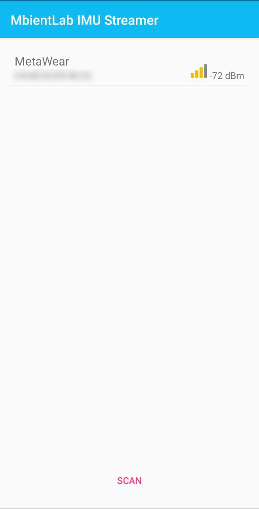
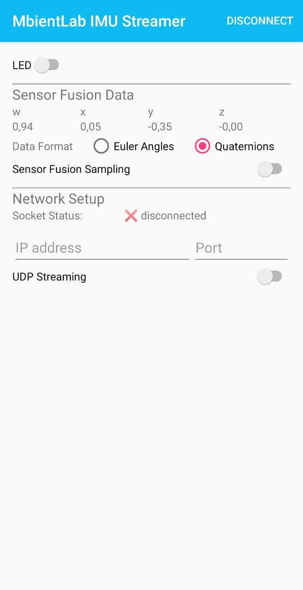

# MbientLab-IMU-Streamer
A simple Android App that enables streaming the IMU sensor values (namely Sensor Fusion) of an MbientLab board via UDP.

## Screenshots

| Device Selection             | UDP Streaming                 |
| ---------------------------- | ----------------------------- |
|  |  |

In the **UDP streaming** view, you can...

* select the rotation format (euler angles vs. quaternions)
* activate or deactivate the sensor fusion sampling (the sampled values are displayed in the app)
* activate or deactivate the UDP streaming (by entering IP adress and port of a device in the local network)

## UDP Data Format

* For Euler Angles (all values within `[-360, 360]`)

  ```json
  {"heading": 123.4, "pitch": -123.4, "roll": 123.4, "yaw": -123.4}
  ```

* For Quaternions (all values within `[-1, 1]`)

  ```
  {"w": 0.1234, "x": 0.1234, "y": 0.1234, "z": 0.1234}

## :copyright: Credits

Parts of the code are heavily influenced by the official mbientlab tutorials and example code repositories:

- [`mbientlab/MetaWear-Tutorial-Android`](https://github.com/mbientlab/MetaWear-Tutorial-Android) (based on the `starter` setup)
- [`mbientlab/MetaWear-SampleApp-Android`](https://github.com/mbientlab/MetaWear-SampleApp-Android) (*archived repository*)
